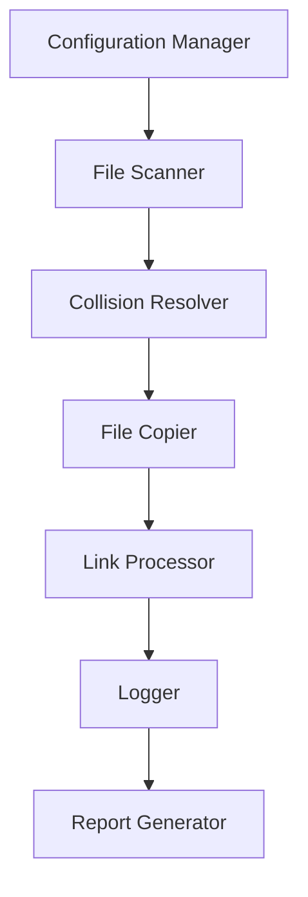

# Obsidian Vault Merger - Architecture Design

## Overview
This document outlines the architecture design for the Obsidian Vault Merger tool, which merges multiple Obsidian vaults into a single vault while preserving file integrity and maintaining internal link consistency.

## System Architecture

### High-Level Architecture

### Key Components

1. **Configuration Manager**
   - Handles source and destination path configuration
   - Manages file type filters and folder structure preferences
   - Validates input paths

2. **File Scanner**
   - Recursively scans all source vaults
   - Builds inventory of all files and directories
   - Identifies dot-prefixed folders for exclusion
   - Detects potential filename collisions across all vaults

3. **Collision Resolver**
   - Implements filename collision resolution strategy
   - Renames files with collisions using ~1, ~2, ~3 pattern
   - Maintains rename log for link updating

4. **File Copier**
   - Copies files from source vaults to destination vault
   - Preserves folder structures during copying
   - Preserves file metadata where possible

5. **Link Processor**
   - Parses all markdown files for internal links
   - Detects wikilinks ([[file]]) and markdown links ([file](path/to/file))
   - Updates internal links to reflect renamed files
   - Creates comprehensive link mapping file

6. **Logger**
   - Tracks all file operations
   - Logs file renames due to collisions
   - Records processing errors and permission issues

7. **Report Generator**
   - Generates comprehensive HTML log file for each merge
   - Creates link mapping file showing all internal references
   - Produces error report for any unresolved links
   - Validates link integrity after updates

## Data Structures

### File Inventory Record
- Original path
- Filename
- File metadata
- Collision status

### Collision Map
- Original filename
- List of conflicting files
- Resolved filenames

### Rename Log
- Original filename
- New filename
- Source vault

### Link Record
- Source file
- Target file
- Link type (wikilink/markdown)
- Link text
- Link position in file

### Link Mapping File Format
- Format: `target_file.md <- source_file.md`
- One link per line for easy parsing

## Workflow Phases

### 1. Configuration Phase
- Accept multiple source vault paths
- Accept destination vault path
- Configure file type filters (if any)
- Set folder structure preference (preserve/flatten)

### 2. Analysis Phase
- Recursively scan all source vaults
- Build inventory of all files and directories
- Identify dot-prefixed folders for exclusion
- Detect potential filename collisions across all vaults
- Parse all markdown files for internal links
- Create comprehensive link mapping file

### 3. Processing Phase
- Create destination vault directory structure
- Copy files from source to destination
- Apply collision resolution for duplicate filenames
- Log all file renames for link updating
- Preserve file metadata where possible

### 4. Link Updating Phase
- Process link mapping file
- Update all internal links to reflect file renames
- Validate that all links point to existing files
- Generate report of any unresolved links

### 5. Finalization Phase
- Generate comprehensive operation log
- Create summary report of merged content
- Validate integrity of merged vault
- Clean up temporary files

## Implementation Considerations

### Collision Resolution Strategy
- First file encountered keeps its original name
- Subsequent files with the same name are renamed with sequential numbers
- Pattern: `filename~1.extension`, `filename~2.extension`, etc.
- All links pointing to renamed files are updated accordingly

### Link Detection and Updating
- Support both wikilink formats: `[[filename]]` or `[[filename|display]]`
- Support markdown link formats: `[text](filename.md)` or `[text](path/filename.md)`
- Preserve link display text and formatting during updates
- Use rename log to map old filenames to new filenames

### Error Handling
- Log files that cannot be processed
- Report unresolved links after processing
- Handle permission errors gracefully
- Continue processing other files when individual files fail

## Success Criteria
- All files from source vaults are present in destination vault
- No data loss from source vaults
- All internal links correctly point to their targets
- Folder structures preserved according to user preference
- Comprehensive logs of all operations
- These criteria are being checked after each vault merging and are part of the report