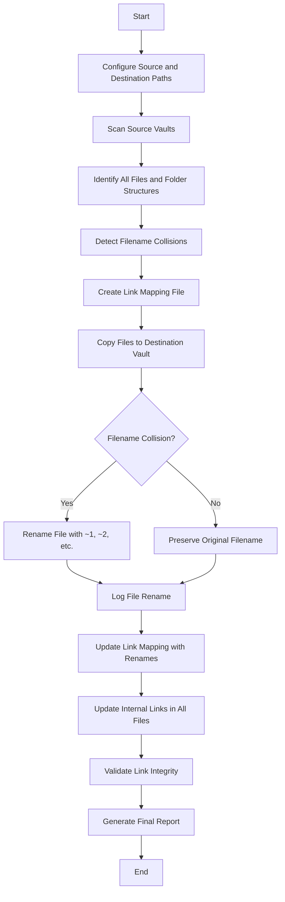

# Obsidian Vault Merger Workflow

## Process Flow Diagram

## Detailed Workflow Steps

### 1. Configuration Phase
- Accept multiple source vault paths
- Accept destination vault path
- Configure file type filters (if any)
- Set folder structure preference (preserve/flatten)

### 2. Analysis Phase
- Recursively scan all source vaults
- Build inventory of all files and directories
- Identify dot-prefixed folders for exclusion
- Detect potential filename collisions across all vaults
- Parse all markdown files for internal links
- Create comprehensive link mapping file

### 3. Processing Phase
- Create destination vault directory structure
- Copy files from source to destination
- Apply collision resolution for duplicate filenames
- Log all file renames for link updating
- Preserve file metadata where possible

### 4. Link Updating Phase
- Process link mapping file
- Update all internal links to reflect file renames
- Validate that all links point to existing files
- Generate report of any unresolved links

### 5. Finalization Phase
- Generate comprehensive operation log
- Create summary report of merged content
- Validate integrity of merged vault
- Clean up temporary files